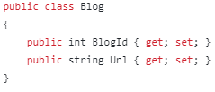
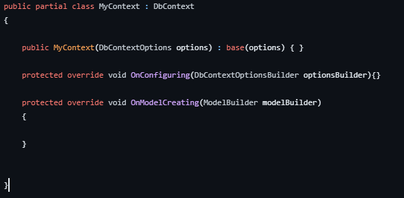
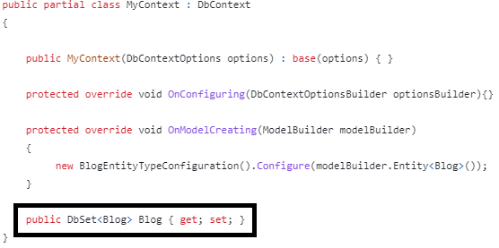
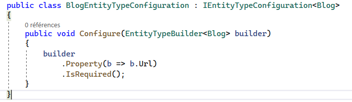
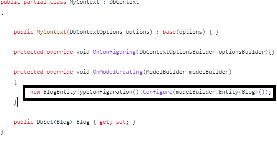

# [EN](README_EN.md) / [FR](README.md)

---------------------------------
# 1.


# 2.


# 3.


# 4.


---------------------------------

## CLI (Ligne de commande)

*Via le terminal (clic droit sur le projet et choisir => 'Ouvrir dans terminal'.*  

----------------

### NuGet Package à installer
**A faire en début de projet**  

`dotnet add package Microsoft.EntityFrameworkCore.Design`  
`dotnet add package Microsoft.EntityFrameworkCore.SqlServer`

### CLI
**A faire à la fin quand la structure des fichiers a été établie**  

1. `dotnet ef migrations add init`
2. `dotnet ef database update`

-----------------------
# Shéma à suivre pour la création de A à Z *(simple)*.

## 1. **Créer son ou ses modèles.**

   *C'est quoi un modèle ?*  
   
   *=> C'est tout simplement la représentation de nos tables en base de données.*



## 2. **Créer la classe du contexte.**



Exemple dans le code :   
=> [Projet_Entity_Framework_Code_First/DataBase/Context/MyContext.cs](Projet_Entity_Framework_Code_First/DataBase/Context/MyContext.cs).

## Ajouter le modèle créée




## 3. **En même temp rajouter la chaîne de connection dans le fichier program.cs :**

```C#
builder.Services.AddDbContext<MyContext>(option =>
{
    option.UseSqlServer(builder.Configuration.GetConnectionString("nom_référence_json"));
});
```
   *=> Celui-ci vas rechercher la chaîne de connection dans le fichier appsettings.json => "nom_référence_json", voire étape suivante*


## 4. **Le fichier .json ce présente comme ceci :**
Aide pour la syntaxe de la connection string : https://www.connectionstrings.com/
```json
"ConnectionStrings": {
    "nom_référence_json": "Data Source=(localdb)\\MSSQLLocalDB;Initial Catalog=Nom_De_Ma_DB;Integrated Security=True;"
  }
```

## 5. **Créer un fichier EntityTypeConfiguration.cs (si besoin).**  
  *=> Le but ici est de ne pas trop charger la classe de contexte de base.*   


  
  Exemple dans le code : 
  [Projet_Entity_Framework_Code_First/DataBase/DatabaseTypeConfigurations/BlogEntityTypeConfiguration.cs](Projet_Entity_Framework_Code_First/DataBase/DatabaseTypeConfigurations/BlogEntityTypeConfiguration.cs)

### Et ajouter celle-ci dans vôtre classe de contexte, comme ci dessous


----------------------
  
## Conclusion
Il suffit ensuite d'exécuter les commandes de 'migrations' puis de 'update' et la base de donnée sera créée ainsi que les tables et différentes contraintes.
