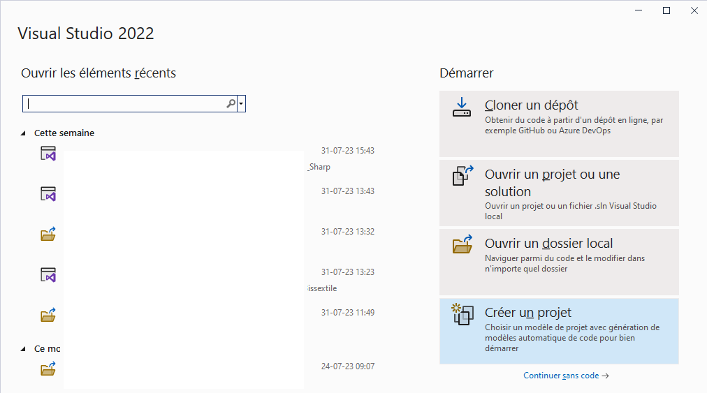
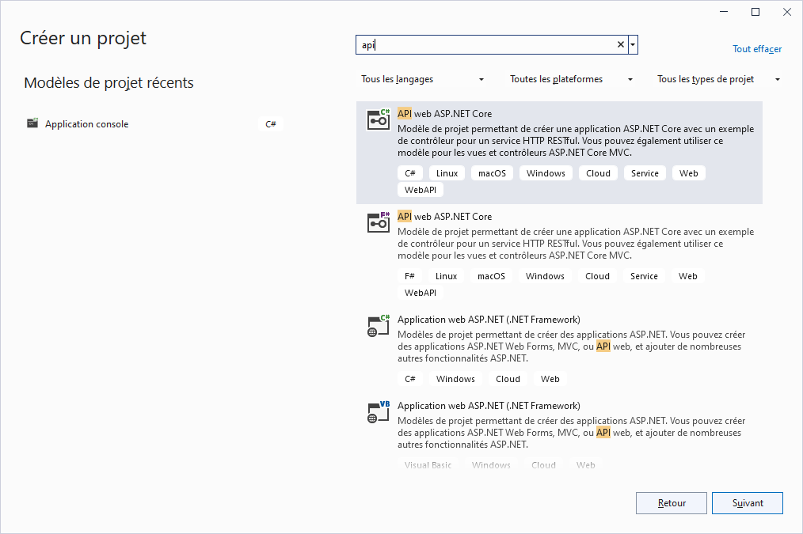
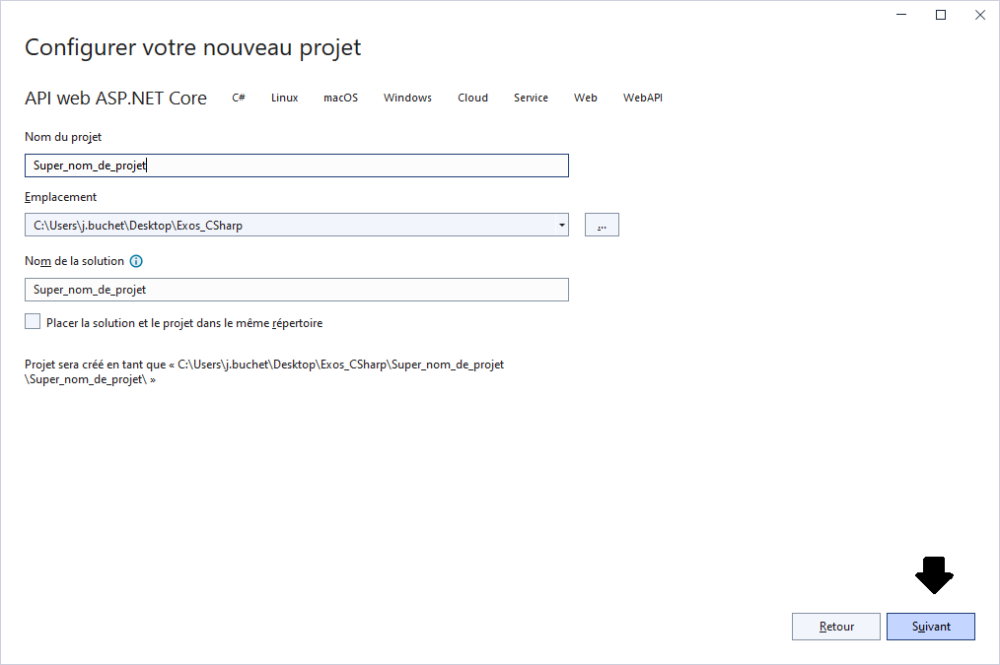
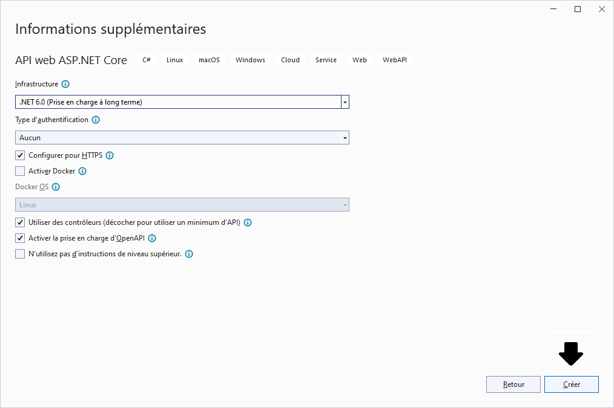

#  [FR](README.md) / [EN](README_EN.md)

---------------------------------

# 1.


# 2.


# 3.


# 4.



---------------------------------

## CLI (Command Line Interface)

*Through the terminal (right-click on the project and choose => 'Open in Terminal').*  

----------------

### NuGet Packages to Install

**To be done at the beginning of the project**  

`dotnet add package Microsoft.EntityFrameworkCore.Design`  
`dotnet add package Microsoft.EntityFrameworkCore.SqlServer`

### CLI
**To be done at the end, once the file structure has been established**  

1. `dotnet ef migrations add init`
2. `dotnet ef database update`

-----------------------
# Step-by-Step Guide for Creating A to Z (simple).*.

## 1. **Create your model(s).**

   *What is a model ?*  
   
   *=>  It's simply the representation of our tables in the database.*

## 2. **Create the context class.**
Example in code :   
=> [Projet_Entity_Framework_Code_First/DataBase/Context/MyContext.cs](Projet_Entity_Framework_Code_First/DataBase/Context/MyContext.cs).


## 3. **At the same time, add the connection string in the program.cs file :**

```C#
builder.Services.AddDbContext<MyContext>(option =>
{
    option.UseSqlServer(builder.Configuration.GetConnectionString("nom_référence_json"));
});
```
   *=> This will retrieve the connection string from the appsettings.json file.*


## 4. **The .json file looks like this :**

```json
"ConnectionStrings": {
    "nom_référence_json": "Data Source=(localdb)\\MSSQLLocalDB;Initial Catalog=Nom_De_Ma_DB;Integrated Security=True;"
  }
```

## 5. **Create an EntityTypeConfiguration.cs file (if needed).**  
  *=> The goal here is to not overload the base context class too much.*   
  
  Example in code : 
  [Projet_Entity_Framework_Code_First/DataBase/DatabaseTypeConfigurations/BlogEntityTypeConfiguration.cs](Projet_Entity_Framework_Code_First/DataBase/DatabaseTypeConfigurations/BlogEntityTypeConfiguration.cs)

----------------------
  
## Conclusion
Then simply execute the 'migrations' and 'update' commands, and the database will be created along with the tables and various constraints.
